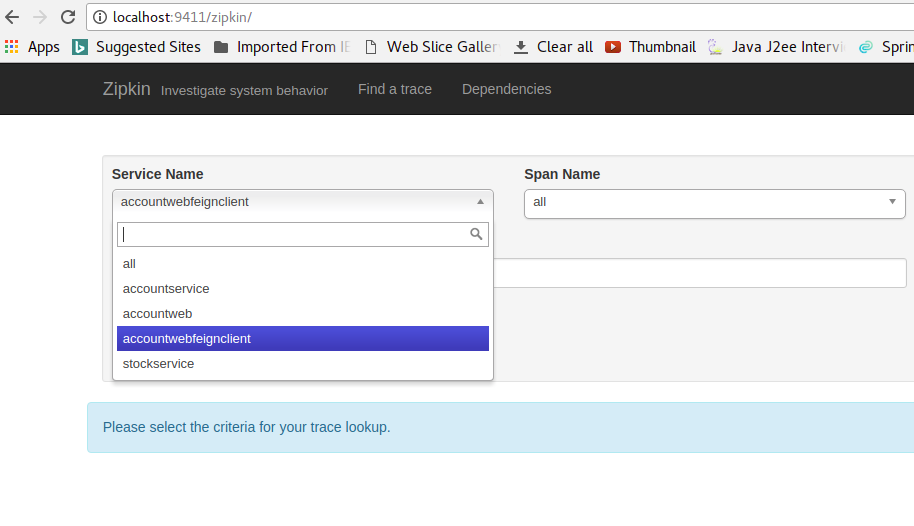

# springboot-zipkin-demo
This project explains how to implement zipkin in springboot microservices.

## Springcloud  Zipkin ##

Zipkin is very efficient tool for distributed tracing in microservices ecosystem. Distributed tracing, in general, is latency measurement of each component in a distributed transaction where multiple microservices are invoked to serve a single business usecase. Let’s say from our application, we have to call 4 different services/components for a transaction. Here with distributed tracing enabled, we can measure which component took how much time.

This is useful during debugging when lots of underlying systems are involved and the application becomes slow in any particular situation. In such case, we first need to identify see which underlying service is actually slow. Once the slow service is identified, we can work to fix that issue. Distributed tracing helps in identifying that slow component among in the ecosystem.

## Screenshot ##

